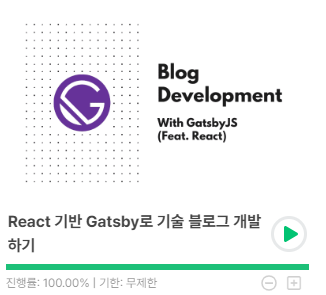

### 1. 기술 블로그 시작

- 티스토리와 velog 등의 플랫폼에서 간간히 개발글을 작성하다가, 내 입맛대로 꾸밀 수 있는 블로그의 필요성을 느끼게 되었다.

- 티스토리의 경우, 플랫폼 종속이라 제약이 존재했으며, (그래도 가장 훌륭한 곳이라고 생각한다..) 나는 개발 외적인 포스팅도 작성하기 때문에 내 블로그가 뭔가 짬뽕이 되가는 기분이었다.

- velog의 경우엔 마크다운으로 손쉽게 작성 가능하고 독자들도 많기에 많이 망설였는데, 글이 누적되고 나중에 구글 애드센스같은것을 적용하기엔 제약이 존재한다고 생각했다.  
  무엇보다 나는 개발자인데 내가 직접 운영하는 블로그를 만들어보고 싶은 마음이 가장 컸다.

- 처음엔 맨땅에 헤딩으로 만들어볼까 생각도 해봤지만, 너무 시간도 많이들고, 맨땅에 헤딩으로 만드는건 블로그 말고 다른 서비스를 만드는게 더 도움이 될 것 같았다.

 

### 2. 참고 사이트

나는 이 블로그를 만들 때 아래 인프런 강의를 참고해서 만들었다.

https://www.inflearn.com/course/gatsby-%EA%B8%B0%EC%88%A0%EB%B8%94%EB%A1%9C%EA%B7%B8/dashboard

Gatsby를 처음 사용해보기도 했지만, 매우 강력한 기능을 가진 프레임워크라고 생각한다.  
첫 포스팅을 작성하는 지금 시점으로는 강의를 따라한 결과물에 불과하지만,
점차 내 입맛대로 수정하고 가꿔나가야겠다.😊

---

## Source

- SEO 기본 가이드

  [<https://support.google.com/webmasters/answer/7451184?hl=ko&ref_topic=9460495>](https://support.google.com/webmasters/answer/7451184?hl=ko&ref_topic=9460495)
