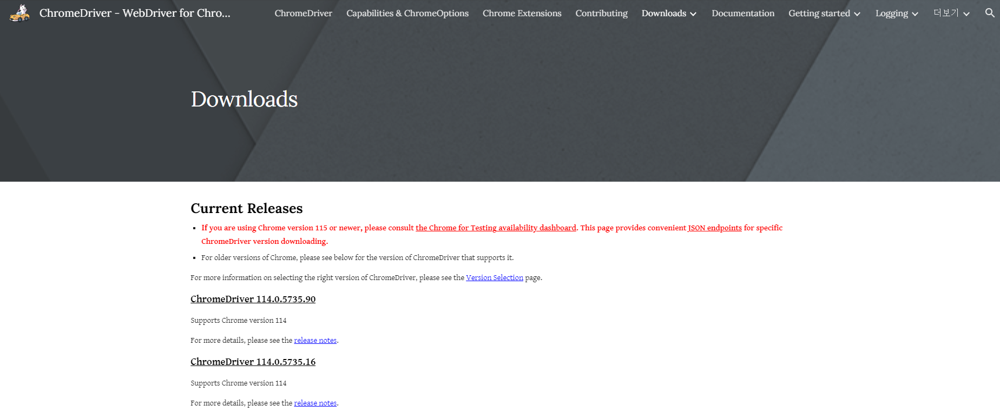
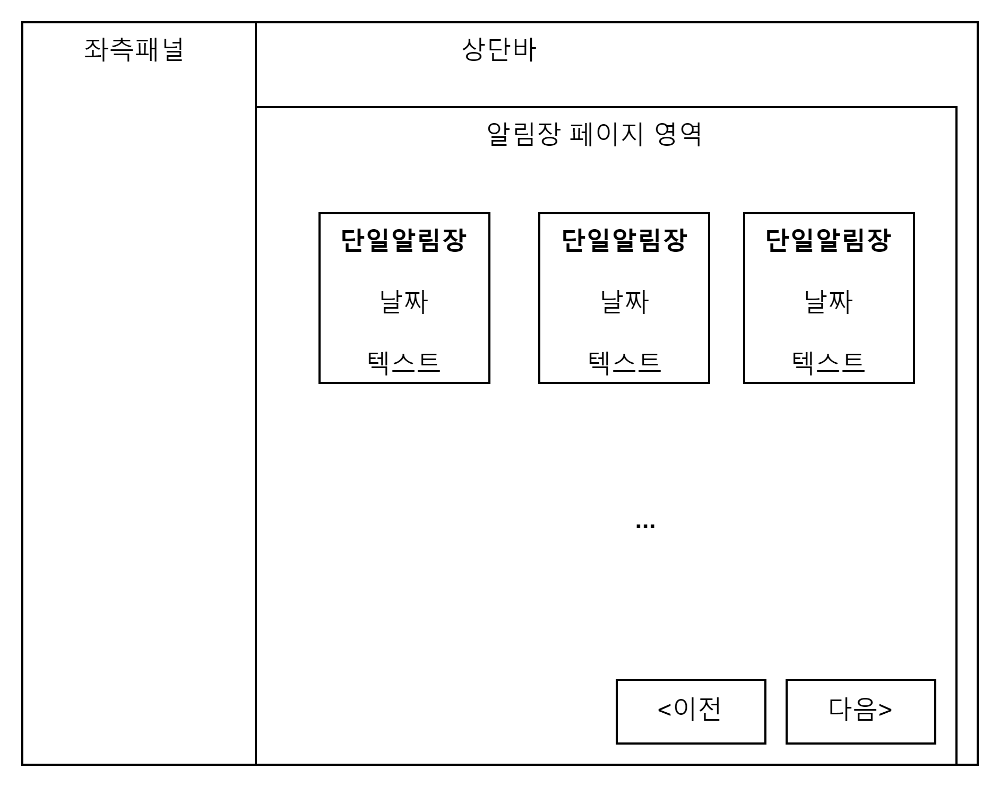
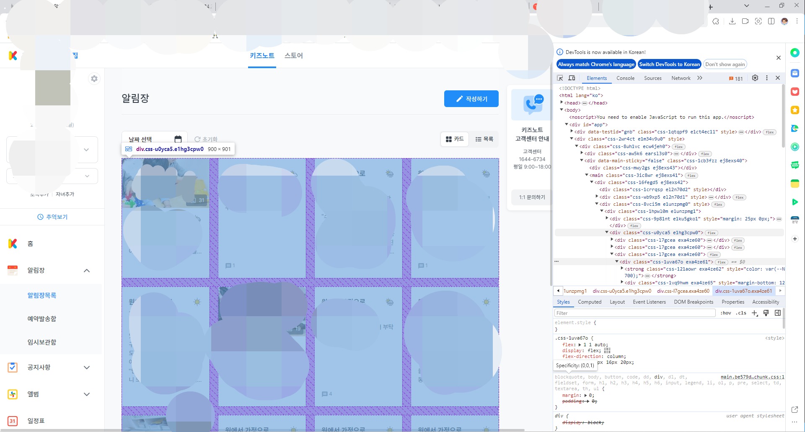

## 1. 개요

키즈노트에서는 알림장을 export 하는 기능을 제공하지 않습니다 ㅠㅠ (적어도 현재까지는요)  
하지만 저는 선생님들이 매일같이 써주는 알림장 데이터가 너무나 소중한데, 언제 없어질지 모를 키즈노트 서비스를 믿고 알림장 조회를 위해 키즈노트 사이트에서 추억을 볼수는 없지 않을까? 라는 생각이 들었습니다.(유료화가 될수도 있고 ...) 그래서 크롤링을 통해 알림장 데이터를 저장하는 서비스를 만들어보게 되었습니다.
  

## 2. 사용도구

- Python : 크롤링 코드를 작성하기 위한 프로그래밍 언어입니다. 여기서는 Selenium과의 호환성을 위해 Python 3.8 을 활용했습니다.
- Selenium : Web Application의 테스트 도구입니다. 크롤링, 자동화 분야에서 두루 사용중인 프레임워크입니다.
- ChromeDriver : Selenium이 실제로 웹 브라우져를 제어하기 위한 프로그램입니다.  
   https://chromedriver.chromium.org/downloads  
   작업일 기준으로 ChromeDriver 114.0.5735.90 이 Chrome 114 버전을 지원하는 최신 버전입니다.
  
  크롬 버전이 중요한 이유는, Selenium이 Chrome Driver를 활용해서 사람이 하는 것처럼 웹브라우져를 제어하기 때문입니다. 보통 크롬은 자동으로 최신버전으로 업데이트를 해주기 때문에 ChromeDriver 이 지원하는 버전에 맞는 크롬을 설치해야 합니다.

- Chrome 브라우저 : 실제로 크롤링에 활용할 웹브라우저입니다. ChromeDriver가 보통 최신의 크롬브라우저 지원을 따라가지 못하기 때문에 다운로드받을 ChromeDriver 버전에 맞는 크롬 브라우저를 설치해야합니다. 이번 케이스에서는 114 버전을 사용하였습니다.  
  아래 링크에서 버전별 크롬 브라우저 설치파일을 받을 수 있습니다.  
  https://google-chrome.kr.uptodown.com/windows/versions

  

## 3. 분석

### 사이트 구조 분석

제가 수집할 내용은 알림장의 날짜와 알림장내용 입니다. 웹브라우저에서 해당 부분을 우클릭하여 검사를 누르면 개발자모드가 표출되면서 해당 부분의 코드를 찾을 수 있습니다.
화면영역과 코드부분을 번갈아가면서 하이라이트 된 부분을 확인하고 구조를 파악합니다.
구조를 파악해서 아래 그림처럼 분석이 되었습니다.

알림장 페이지를 보면 작성된 알림장 1건이 카드 형태로 되어있고, **4x3 배열**로 구성되어있음을 알 수 있습니다.

그리고 하단엔 이전페이지, 다음페이지를 조회할 수 있는 **버튼**이 있습니다.  
  

### 수집 대상 분석

 

#### 알림장 모음 영역 찾기

우선 알림장들이 모여있는 영역의 바로 바깥 레이어의 div 를 찾습니다.  
(모자이크가 많이 지저분하네요 ㅜㅜ 그래도 개인정보는 소중하니까요 ^^)

코드부분에 마우스를 올리면 해당 부분이 브라우저 화면 영역에 하이라이트 됩니다.
(개인정보를 위한 모자이크와 헷갈리지 마세요 ㅋㅋ 하이라이트는 하늘색 부분입니다.)  
https://google-chrome.en.uptodown.com/windows/versions

  

#### 알림장 영역 찾기

#### 날짜, 텍스트 영역 찾기

### 크롤링 흐름 정의

## 4. 코딩

## 5. 실행

## 6. 기능확장?

키즈노트 사이트나 앱에서 보는것과 비교할때 가장 큰 단점은 사진이 표출되지 않는다는 점입니다. 알림장과 사진이 함께 보이면 더더욱 좋겠지만 서비스 제작목적과는 좀 벗어나있죠.. 그래서 나중에 여유가 된다면 사진까지 함께 저장해서 pdf나 웹사이트에서 내 입맛대로 볼수있는 기능도 추가해볼까 합니다.

[TBD]
