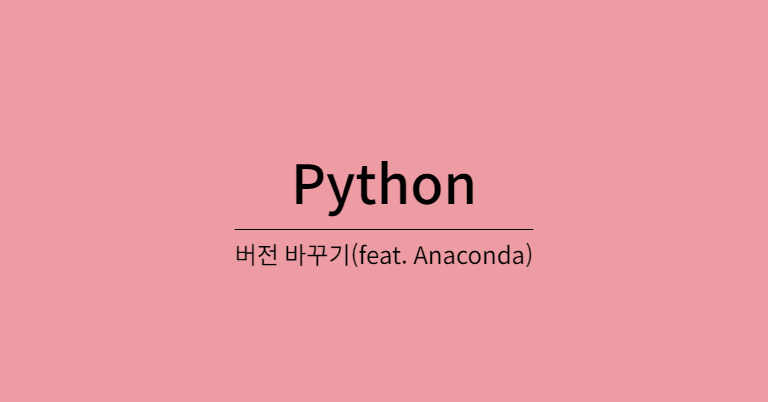
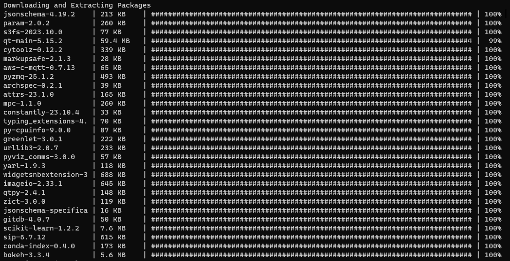

<br /><br />

# 파이썬 버전 변경하기 (Feat. Anaconda)

파이썬을 사용하다보면, 라이브러리 활용을 위해 파이썬 버전을 변경해야할 일이 종종 생깁니다. 이번에는 Anaconda 사용자라는 전제로, 쉽게 파이썬 버전을 변경하는 방법에 대해 알아보겠습니다.
<br /><br />

## 1. 현재 파이썬 버전 확인하기.

현재 사용하고 있는 파이썬 버전을 확인하는 방법은 다음과 같습니다.

```bash
python --version

# 출력
# Python 3.11.5
```

예를 들어, 사용해야할 파이썬 버전이 3.8 버전이라면, 어떻게 변경할까요?

기존 파이썬을 삭제하고 새로 설치하는 방법이 있지만, 기존 버전이 여전이 필요할 수도 있고, 좋은 방법은 아닙니다. Anaconda 에서는 파이썬 버전도 관리 할 수 있도록 지원합니다.
<br /><br />

## 2. Anaconda 로 원하는 파이썬 버전 설치하기

먼저, 원활한 패키지 설치를 위해 Anaconda packages를 업데이트 해줍니다.  
(anaconda 환경변수가 지정이 안되어있을 경우, Anaconda Prompt로 진행합니다.)

```bash
conda update --all
```

업데이트할 리포지토리들 목록을 보여주고, 진행여부를 물으면 Y를 입력해서 다음 단계로 진행해줍니다.



done이 출력되면서 위 화면과 같은 과정이 완료되면 이제 원하는 파이썬 버전을 설치 해줍니다.

```bash
conda install python=3.8
```

마찬가지로, 패키지 목록을 보여주고, 진행여부를 물으면 Y를 입력해서 다음 단계로 진행하고 done이 출력되며 설치가 마무리 됩니다.  
이제 버전을 다시 확인 해봅니다.

```bash
python --version

# 출력
# Python 3.8.18
```

Python 3.8 설치를 요청했는데, 3.8.18 버전이 설치되어있는걸 볼 수 있습니다. 3.8버전중 가장 최신버전을 설치해주는 것으로 보입니다.
<br /><br />

이상으로 간단히 파이썬 버전을 변경하는 방법을 알아보았습니다.
