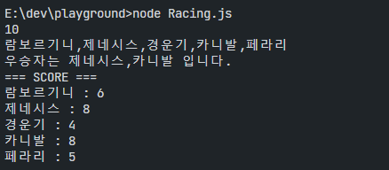

# 1. 자동차 경주

velog에서 글을 보다가 코딩테스트의 TDD관련글을 보다가 나도 한번 풀어보고 싶어서 해봤다.

문제는 아래와 같다.

```
- 주어진 횟수 동안 n대의 자동차는 전진 또는 멈출 수 있다.
- 각 자동차에 이름을 부여할 수 있다. 전진하는 자동차를 출력할 때 자동차 이름을 같이 출력한다.
- 자동차 이름은 쉼표(,)를 기준으로 구분하여 이름은 5자 이하만 가능하다.
- 사용자는 몇 번의 이동을 할 것인지를 입력할 수 있어야 한다.
- 전진하는 조건은 0에서 9사이에서 random 값을 구한 후 random 값이 4이상일 경우 전진하고, 3이하의 값이면 멈춘다.
- 자동차 경주 게임을 완료한 후 누가 우승했는지를 알려준다. 우승자는 한 명 이상일 수 있다.
```

실제 문제와 같은지 모르겟지만, ~~요약된느낌이...~~ 문제 자체에서 요구사항이 모호한 부분이 있긴 하다. 어차피 재미로 하는거니까 모자란 요구사항은 자율적으로 원하는 결과가 나올 수 있게끔 코딩했다.
<br /><br />

## 1. 요구사항 분석

문제를 통해 구현에 필요한 것들을 식별했다.

- 사용자 입력받기 (함수)
  - 2줄을 입력받을 수 있어야 한다. (횟수, 자동차명)
- 자동차 (변수)
  - 자동차 이름을 입력받아야 하며, 이름은 쉼표 구분으로 여러개의 이름을 입력받을 수 있다.
  - cars 배열을 만들어 쉼표 구분으로 나누어 배열에 담는다.
- 횟수 (변수)
  - 횟수는 입력받아야 하며, 1이상의 정수만 입력받는다.
- 자동차 경주(함수)
  - 입력받은 자동차들에 대해 횟수만큼 랜덤한 한자리 수를 발생시킨다.
  - 랜덤 수가 4 이상일 경우 위치를 1씩 올린다.
- 경주 종료 (함수)
  - 경주가 종료되면 누가 우승했는지 출력한다.
  - 우승 자동차명을 출력한다. (동점일 경우 우승자 모두 출력)

<br /><br />

## 2. 코드 구현

분석한 요구사항을 기반으로 코드를 작성한다.
<br /><br />

### 2-1. 변수 선언

```javascript
// 횟수
let count = 0

// 입력받은 자동차 문자열
let car = ''

// 자동차 배열
let cars = []
```

사용자에게 횟수, 자동차 문자열을 입력받아 각각 count, car에 담는다.
입력받은 문자열은 cars 배열에 각각 담는다.
<br /><br />

### 2-2. 사용자 입력받기

```javascript
const readline = require('readline')

var rl = readline.createInterface({
  input: process.stdin,
  output: process.stdout,
})

let input = []

rl.on('line', line => {
  input.push(line)
  count = Number(input[0])
  if (
    count < 1 ||
    Number.isInteger(count) == false ||
    Number.isNaN(count) == true
  ) {
    console.log('횟수는 1이상의 정수여야 합니다.')
    process.exit()
  }
  car = input[1]
  car && divide(car)
  // rl.close()
})

rl.on('close', () => {
  runGames(cars)
  finishGame(cars)
  process.exit()
})

const divide = car => {
  let temp = car.split(',')

  temp.map(carName => {
    if (carName.length >= 5) {
      console.log(
        '차이름은 5자 이하여야 합니다. 해당 차량은 경주에서 실격입니다.',
      )
    } else {
      cars.push({ name: carName, position: 0 })
    }
  })
}
```

Node 로 javascript를 돌릴 경우 자주 사용하는 `readline` 함수를 사용하여 사용자 입력을 받도록 했다.  
`divide` 함수는 입력받은 자동차 문자열을 쉼표로 구분하여 cars 배열에 담는다. 단, 5글자 이하여야 하기 때문에 5글자 이상이면 굳이 에러처리를 시키기 보다는, `실격처리 후 배열에 담지 않도록 처리`했다. ~~자율성 개꿀~~  
그리고 `car`배열에 담을땐 각각의 자동차 정보는 `{name: carName, position: 0}` 형태로 객체로 관리하도록 해서 담았다.
첫 번째로, `count` 변수에 사용자가 입력한 횟수를 담는다. 이 때, 입력한 값이 정수가 아니거나, 숫자가 아니면 조건을 출력한 후 프로그램을 종료하도록 validation 처리를 하였다.  
두 번째로, `car` 변수에 사용자가 입력한 자동차 이름을 담는다. 입력값이 공백이 아닐 경우에만 `divide` 함수를 실행한다.

<br /><br />

### 2-3. 자동차 경주 함수 구현

```javascript
const runGames = cars => {
  cars.map(car => {
    for (let i = 1; i <= count; i++) {
      let randomNo = Math.floor(Math.random() * 10)

      if (randomNo >= 4) {
        car.position = car.position + 1
      }
    }
  })
}
```

`runGames` 함수에서는 자동차배열을 입력받아 `map` 함수와 반복문을 통해 **_횟수만큼_** 각각의 요소들에 `randomNo를` 생성하여 조건 충족시 `position` 을 1씩 증가시키도록 하여 `cars` 배열에 담았다.

<br /><br />

### 2-4. 경주 종료 함수 구현

```javascript
const finishGame = cars => {
  let maxNo = 0
  let winners = []
  cars.map(car => {
    if (car.position > maxNo) {
      winners = []
      maxNo = car.position
      winners.push(car.name)
    } else if (car.position == maxNo) {
      winners.push(car.name)
    }
  })
  console.log(`우승자는 ${winners.toString()} 입니다.`)
  console.log('=== SCORE ===')
  cars.map(car => {
    console.log(`${car.name} : ${car.position}`)
  })
}
```

finishiGame 함수에서는 `cars` 배열을 입력받아 `map` 함수를 통해 각각의 요소들의 `position` 값을 확인 한 후, 최대값을 찾아 `winners` 배열에 담는다. 최대값이 여러명일 수 있어야 하기 때문에, 비교할 때 높은 수를 찾을때는 `winners` 배열을 초기화 한 후 `name을` 담는다. 이를 통해 새로운 최대값 발견 시 기존의 승자는 승자가 아니게 된다. 동일한 값이면 여전히 가장 높은 값을 의미하므로 `winners` 배열에 계속해서 `name을` 추가한다.
`winners` 배열에 담은 값을 `toString()` 함수를 통해 문자열로 변환한 후 출력한다.
<br /><br />

## 3. 실행결과

### 3-1. 정상 Case

<p align='center'>

</p>

### 3-2. 실패 Case (횟수입력 오류)

<p align='center'>

</p>

### 3-3. 실패 Case (자동차명 입력 오류)

<p align='center'>

</p>

<br /><br />

## 4. 느낀점 & 배운점

### Number로 형변환 시 주의할 점

입력값 Validation을 위해 Number로 형변환을 했는데, Number로 형변환을 하면 문자열의 경우 NaN을 반환한다. 그래서 처음엔 `typeof count != 'number'` 로 검사를 했는데, 문자열도 true로 반환을 하고 있었다.  
JavaScript에서 Number() 함수는 주어진 값이 숫자로 변환될 수 없을 경우 NaN을 반환하는데, Number('하')는 NaN을 생성하고, 그 후에 typeof NaN을 하면 'number'가 나오게 된다. 이는 JavaScript에서 `NaN이 숫자 데이터 타입에 속하기 때문`이었다.

<br/>

### 첫 코딩테스트 문제 풀이

난 평소에 코딩테스트같은걸 풀어본 적이 없다. 그런데 요새 개발자들이나 신입들은 코테문제를 엄청나게 많이 풀고, 기업에서도 많이 요구하는거 같다. 해보니 내가 가진 지식을 리마인드 할 수도 있고, 역시 프로그래밍은 구현해야 내가 부족한걸 알게되고 배우게 되는 것 같다는 생각이 들었다. 틈틈이 풀어봐야겠다.

<p align='center'>

</p>

<br /><br />

## 전체 코드

```javascript
const readline = require('readline')

// 사용자 입력. count
var rl = readline.createInterface({
  input: process.stdin,
  output: process.stdout,
})

let input = []

rl.on('line', line => {
  input.push(line)
  count = Number(input[0])
  if (
    count < 1 ||
    Number.isInteger(count) == false ||
    Number.isNaN(count) == true
  ) {
    console.log('횟수는 1이상의 정수여야 합니다.')
    process.exit()
  }
  car = input[1]
  car && divide(car)
  // rl.close()
})

rl.on('close', () => {
  runGames(cars)
  finishGame(cars)
  process.exit()
})

let count = 0
let cars = []

let car = ''

const divide = car => {
  let temp = car.split(',')

  temp.map(carName => {
    if (carName.length >= 5) {
      console.log(
        '차이름은 5자 이하여야 합니다. 해당 차량은 경주에서 실격입니다.',
      )
    } else {
      cars.push({ name: carName, position: 0 })
    }
  })
}

const runGames = cars => {
  cars.map(car => {
    for (let i = 1; i <= count; i++) {
      let randomNo = Math.floor(Math.random() * 10)

      if (randomNo >= 4) {
        car.position = car.position + 1
      }
    }
  })
}

const finishGame = cars => {
  let maxNo = 0
  let winners = []
  cars.map(car => {
    if (car.position > maxNo) {
      winners = []
      maxNo = car.position
      winners.push(car.name)
    } else if (car.position == maxNo) {
      winners.push(car.name)
    }
  })
  console.log(`우승자는 ${winners.toString()} 입니다.`)
  console.log('=== SCORE ===')
  cars.map(car => {
    console.log(`${car.name} : ${car.position}`)
  })
}
```
